## Lab 1 – Create, Assign, Bulk-Add, and Manage Users in Microsoft Entra ID

This lab covered the lifecycle of user management in Microsoft Entra ID:
creating a user, assigning and removing a role, bulk-creating users (via
CSV and PowerShell), deleting/restoring a user, and assigning a license.

---

### Exercise 1: Create a user and test permissions before a role is assigned

- Created a new user, **Chris Green**, through
  **Microsoft Entra ID > Users > All users > New user**.
- Confirmed the user was created by browsing the full users list.
- Signed in as Chris Green in an InPrivate window and attempted to browse
  **Enterprise applications** and **User settings**. Without an assigned
  role, access was denied ("You don't have access").

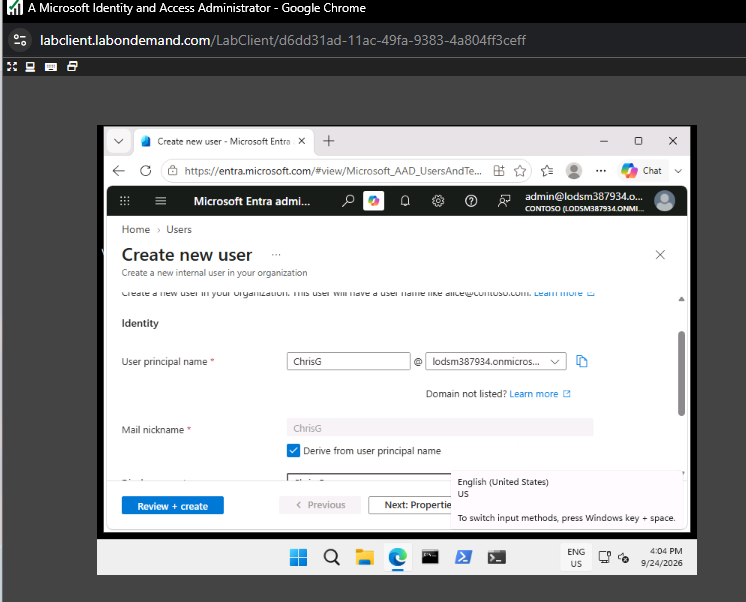
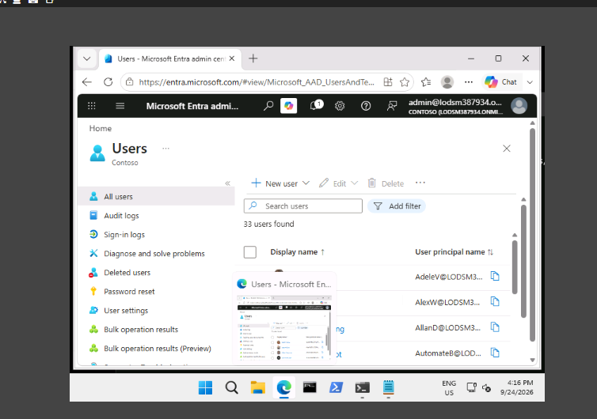
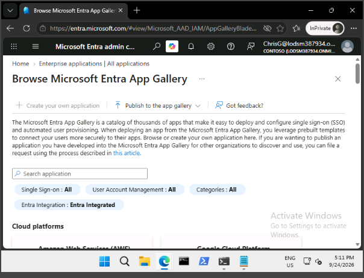
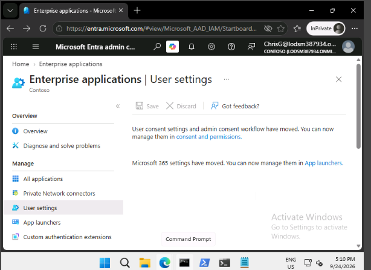
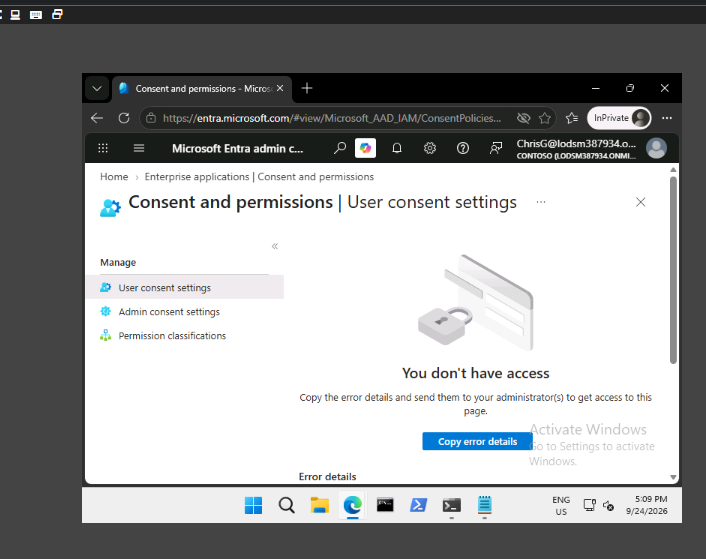

---

### Exercise 2: Assign the Application Administrator role

- Assigned the **Application Administrator** role to Chris Green via
  **Users > Chris Green > Assigned roles > Add assignments**, with
  assignment type **Active** and justification "Needed for lab."
- Confirmed the role was active on Chris Green's **Assigned roles** page.

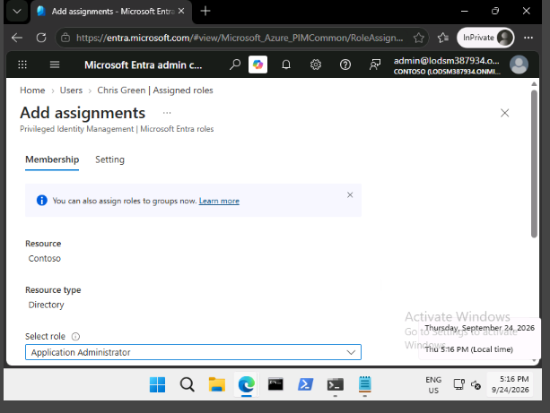
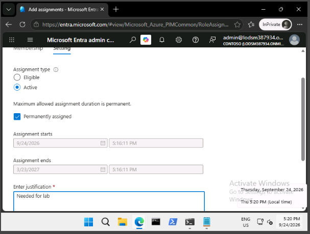
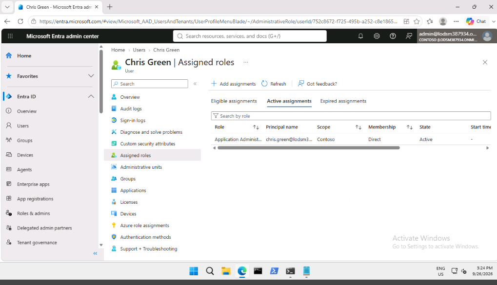

---

### Exercise 3: Remove the role assignment

- Removed the Application Administrator role from Chris Green via
  **Roles and administrators > Application Administrator > Assignments**.

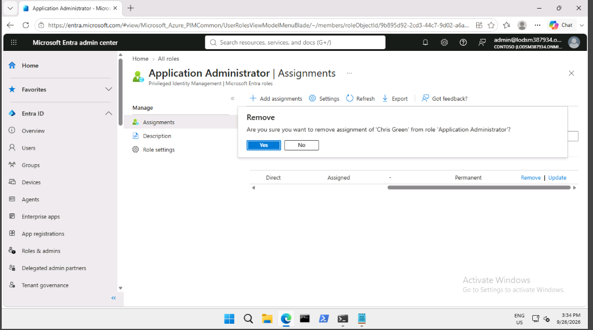

---

### Exercise 4: Bulk addition of users

**Task 1 – CSV bulk import**

- The lab instructions call for using a pre-provided sample file
  (`SC300BulkUser.csv`) and only editing the domain name before
  uploading. In this case, the file needed more correction than
  expected before it would upload successfully, so it was edited in
  Notepad to fix the formatting:
  - Line breaks splitting single rows across two lines (Word wrap in
    Notepad, not actual breaks — resolved by turning Word wrap off)
  - Extra spaces after commas (e.g. `, No` → `,No`)
  - Missing trailing commas — each row needs the same column count as
    the 19-field header
  - Leftover example row from the template, deleted
  - Duplicate entry for Chris Green, removed (already existed from
    Exercise 1)
  - Blank line between the header and the first data row, removed
- Re-uploaded the corrected CSV and the bulk operation completed
  successfully.

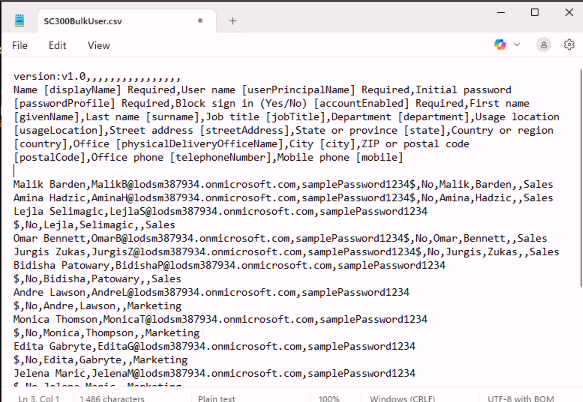
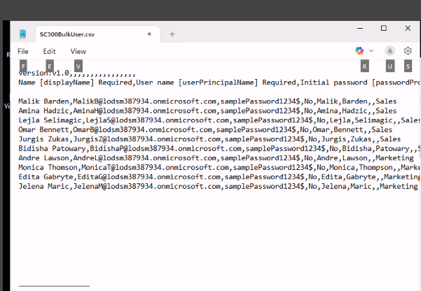
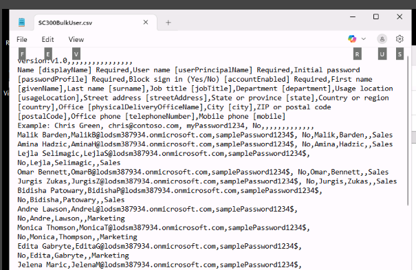
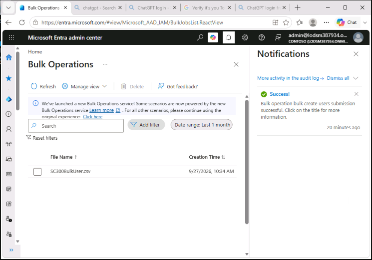

**Task 2 – PowerShell / Microsoft Graph**

- Verified PowerShell version requirements (needed 7.2+; installed
  **PowerShell 7.6** via winget after the direct download link was
  blocked in the lab environment).
- Installed the Microsoft.Graph PowerShell module.
- Connected to the tenant with `Connect-MgGraph -Scopes "User.ReadWrite.All"`
  (using device authentication) and verified with `Get-MgUser`.

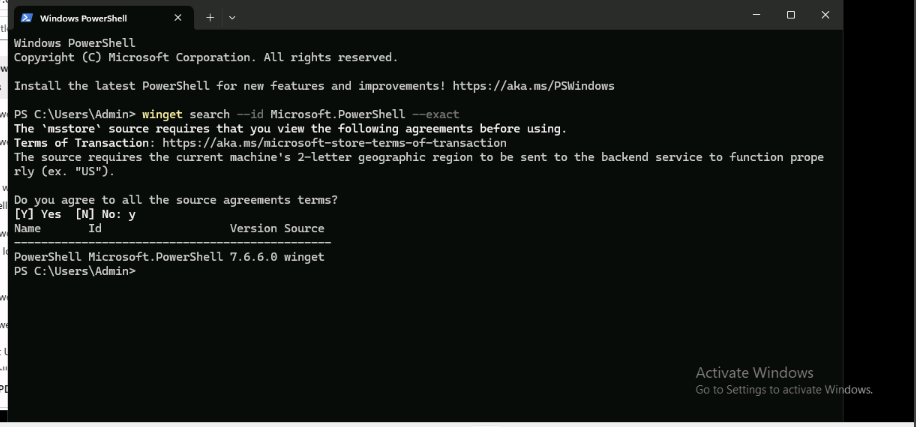
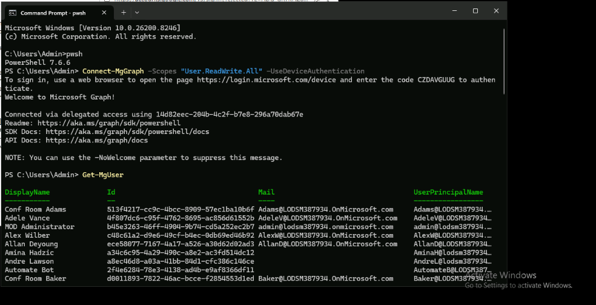

**Commands used (for reference):**

```powershell
$PWProfile = @{
    Password = 'samplePassword1234$';
    ForceChangePasswordNextSignIn = $false
}

New-MgUser -DisplayName "New PW User" -GivenName "New" -Surname "User" `
    -MailNickname "newuser" -UsageLocation "US" `
    -UserPrincipalName "newuser@lodsm387934.onmicrosoft.com" `
    -PasswordProfile $PWProfile -AccountEnabled `
    -Department "Research" -JobTitle "Trainer"
```

---

### Exercise 5: Remove and restore a user

- Deleted Chris Green's account via **Users > All users > Delete**.
- Restored the account via **Users > Deleted users > Restore users**.
  Confirmed with the "User successfully restored" notification.

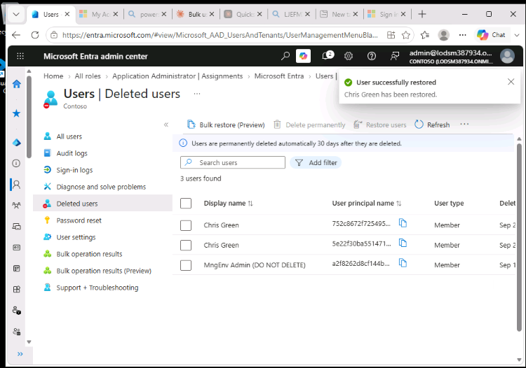

---

### Exercise 6: Assign a license to Raul Razo

- Checked Raul Razo's **Licenses** page beforehand: no license
  assignments found.
- Assigned a Windows 10/11 Enterprise E3 license via the Microsoft 365
  admin center.

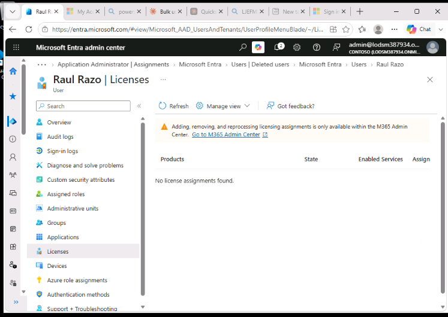

---

### Key takeaways from this lab

- Role-based access in Entra ID takes effect immediately once assigned,
  and is clearly testable by signing in as the affected user before and
  after the change.
- CSV bulk imports are strict about formatting: column count must match
  the header exactly, with no extra spaces and no broken lines.
- PowerShell 7.2+ is required for the Microsoft Graph SDK used in this
  lab; the default Windows PowerShell 5.1 is too old.
- User deletion in Entra ID is a soft delete by default — accounts can
  be restored from the Deleted users list within the retention window.
- Licenses are managed through the Microsoft 365 admin center rather
  than directly in Entra ID, though the Entra ID user profile reflects
  the assigned licenses.
