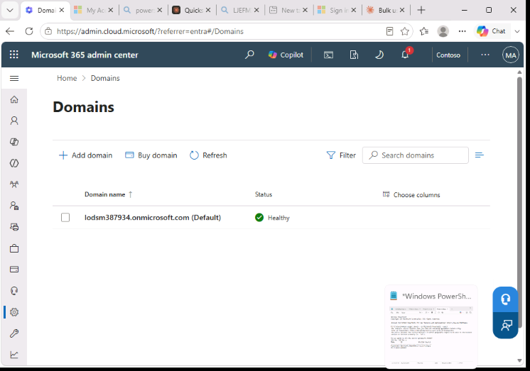
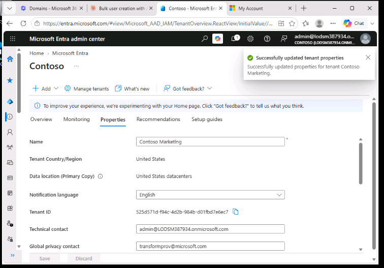
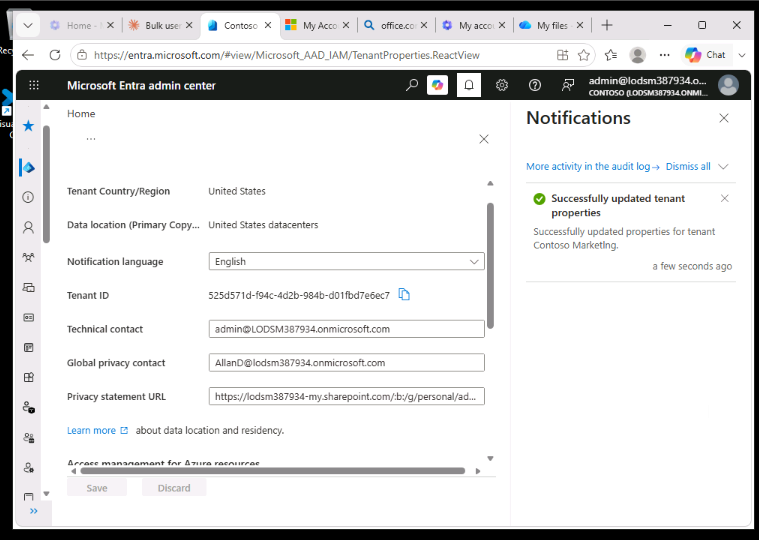

## Lab 2 – Work with tenant properties

**Scenario:** the organization needs to find and update the different properties that belong to its tenant.

**Contents**
- [Exercise 1 – Create a custom subdomain](#exercise-1--create-a-custom-subdomain)
- [Exercise 2 – Change the tenant display name](#exercise-2--change-the-tenant-display-name)
- [Exercise 3 – Set the privacy information](#exercise-3--set-the-privacy-information)

---

### Exercise 1 – Create a custom subdomain

**Task 1 – Create a custom subdomain name**

This exercise walks through how a subdomain is added. The lab does not set up DNS, so the subdomain isn't taken any further. The steps are:

1. Sign in to the Microsoft Entra admin center (`entra.microsoft.com`) as the Global Administrator.
2. Go to **Entra ID > Domain names** and select **+ Add custom domain**.
3. Type a subdomain with `sales` in front of the tenant's `onmicrosoft.com` name, in the form `sales.<tenant>.onmicrosoft.com`.
4. Entra ID explains that `onmicrosoft.com` domains can't be managed there, and links to the Microsoft 365 admin center. Follow the link.
5. In the Microsoft 365 admin center **Domains** page, select **Add domain**, enter the subdomain, and select **Use this domain**.
6. Close the final screen.

The screenshot shows the **Domains** page in the Microsoft 365 admin center, where the tenant's domains are managed.

**Result:** the tenant's own `onmicrosoft.com` domain is managed in the Microsoft 365 admin center. Entra ID is used for domains that the organization has purchased.

---

### Exercise 2 – Change the tenant display name

**Task 1 – Set the tenant name and technical contact**

1. In the Entra admin center, went to **Entra ID > Overview > Properties**.
2. Changed **Name** to `Contoso Marketing` and set the **Technical contact** to the Global Administrator account.
3. Selected **Save**. The new name shows straight away.

**Task 2 – Review the country or region and location**

1. On the same **Properties** page, found **Tenant Country/Region** and **Data location** and read the values.
2. The country or region is chosen when the tenant is created and **can't be changed later**.

**Task 3 – Find the tenant ID**

1. On the **Properties** page, found **Tenant ID**, the unique identifier of the tenant.
2. Copied it into Notepad for use in later labs.

**Result:** the tenant name, contact details and ID are all managed in one place, the tenant **Properties** page.

---

### Exercise 3 – Set the privacy information

**Task 1 – Add the privacy contact and privacy statement**

1. Went to **Entra ID > Overview > Properties**.
2. Set the **Global privacy contact** to Allan Deyoung's account (`AllanD@<tenant>`), an IT admin built into the lab tenant.
3. Pasted the link to the sample privacy statement PDF into **Privacy statement URL**.
4. Selected **Save**.

**Task 2 – Check the privacy statement**

1. Back on the Entra admin center dashboard, selected the account name at the top right and chose **View account**.
2. In **My Account**, opened **Settings & Privacy > Privacy**.
3. Under **Organization's notice**, selected **View** next to the Contoso Marketing privacy statement. The privacy PDF opened in a new tab.
4. Closed the PDF tab and the My Account tab.

**Result:** the privacy contact and statement are shown to internal users and to external guests. Without them, guests see a message saying the organization has not provided its terms.

---

### Key takeaways

- Tenant-level settings (name, contacts, privacy statement) are managed in one place and apply to the whole organization.
- A tenant's country or region is fixed when the tenant is created.
- The tenant's `onmicrosoft.com` domain and its subdomains are managed in the Microsoft 365 admin center.
- The privacy statement set here is shown to users through their My Account page.
