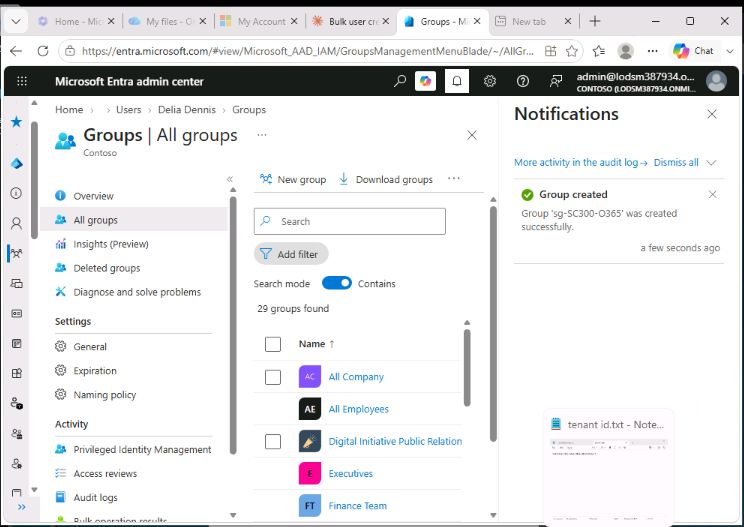
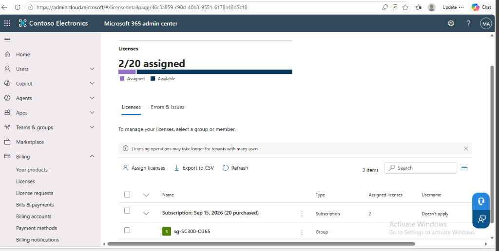
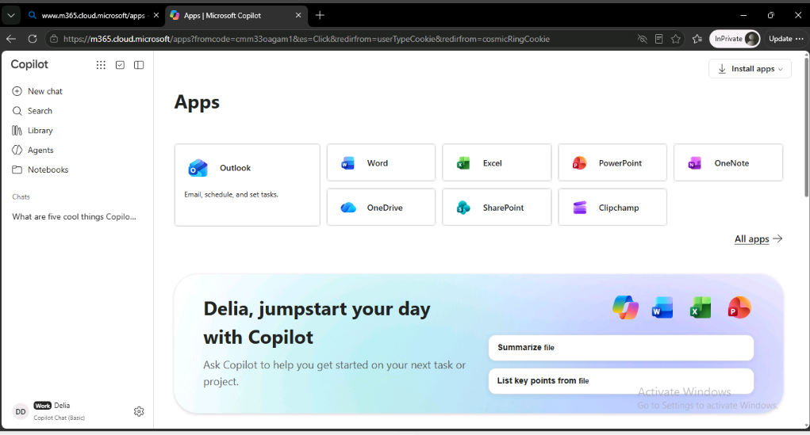
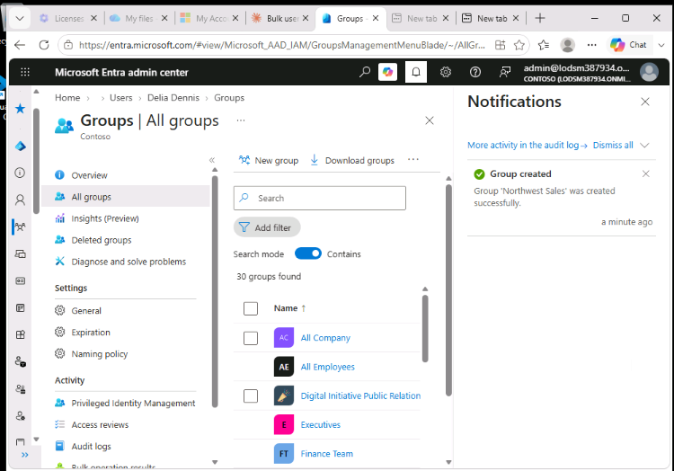
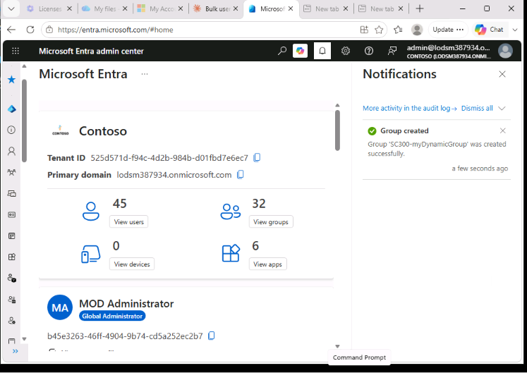
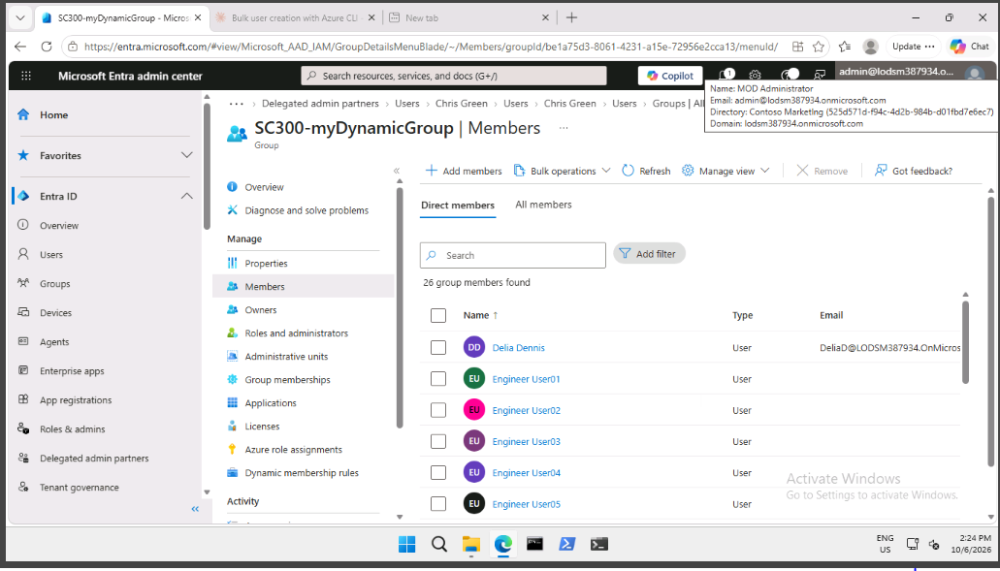
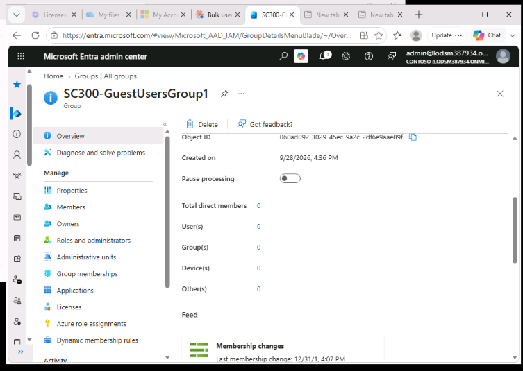
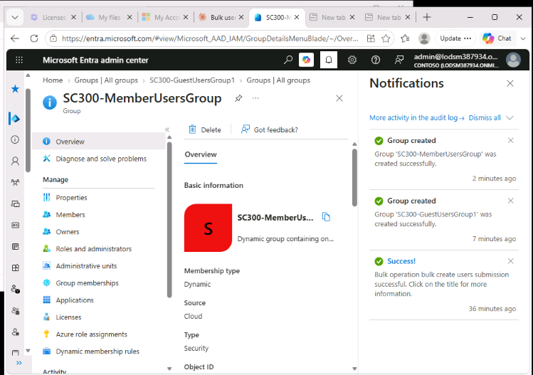

## Lab 3 – Assign licenses using group membership

**Scenario:** the organization wants to manage licenses with security groups in Microsoft Entra ID. The job is to create a group, assign a license to the group, and check that a group member receives the license. The lab then covers Microsoft 365 groups and dynamic groups.

**Contents**
- [Exercise 1 – Create a security group and add a user](#exercise-1--create-a-security-group-and-add-a-user)
- [Exercise 2 – Create a Microsoft 365 group](#exercise-2--create-a-microsoft-365-group)
- [Exercise 3 – Create a dynamic group](#exercise-3--create-a-dynamic-group)

---

### Exercise 1 – Create a security group and add a user

**Task 1 – Check whether Delia Dennis has access to Office 365**

1. Opened a new InPrivate window and went to the Microsoft 365 apps page (`m365.cloud.microsoft/apps`).
2. Signed in as Delia Dennis.
3. Selected **Install apps > Microsoft 365 apps**. No apps were available and a message said she had no license.
4. Closed the window.

**Task 2 – Create a security group**

1. Signed in to the Entra admin center as the Global Administrator.
2. Went to **Entra ID > Groups > All groups** and selected **New group**.
3. Filled in the form:
   - Group type: **Security**
   - Group name: **sg-SC300-O365**
   - Membership type: **Assigned**
   - Owner: the administrator account
4. Under **Members**, selected **Delia Dennis**, then **Select**.
5. Selected **Create** and checked that `sg-SC300-O365` is in the **All groups** list.



**Task 3 – Add an Office license to the group**

1. Opened a new tab at `admin.microsoft.com` and signed in as the administrator.
2. Went to **Billing > Licenses** and selected **Office 365 E3**.
3. Selected **Assign licenses**, searched for `sg-SC300-O365`, selected the group, and selected **Assign licenses**.
4. Closed the confirmation message. The group is listed on the license page, showing 2 of 20 licenses assigned.



5. Back in the Entra admin center, opened **Groups > sg-SC300-O365 > Licenses** to see the license on the group. It can take a few minutes to appear.

**Task 4 – Confirm Delia's license**

1. Opened a new InPrivate window and signed in as Delia Dennis at the Microsoft 365 apps page.
2. No license message appeared, and the Office apps (Outlook, Word, Excel, PowerPoint and others) were available. It can take a few minutes for the license to apply.
3. Closed the window.



**Result:** Delia never received a license directly. She inherited it through her membership of the group.

---

### Exercise 2 – Create a Microsoft 365 group

**Task 1 – Create the group**

1. In the Entra admin center, went to **Entra ID > Groups > All groups** and selected **New group**.
2. Filled in the form:
   - Group type: **Microsoft 365**
   - Group name: **Northwest Sales**
   - Membership type: **Assigned**
   - Owner: the administrator account
   - Members: **Alex Wilber** and **Bianca Pisani**
3. Selected **Create** and checked that `Northwest Sales` is in the **All groups** list.



---

### Exercise 3 – Create a dynamic group

**Task 1 – Create the dynamic group**

1. In the Entra admin center, went to **Groups > All groups > New group**.
2. Set **Group type** to **Security** and named the group `SC300-myDynamicGroup`.
3. Set **Membership type** to **Dynamic User** and chose an owner.
4. Under **Dynamic user members**, selected **Add dynamic query**, then **Edit** above the rule box.
5. Entered the rule below, selected **OK**, then **Save**. The group now includes both members and B2B guest users.

   ```
   user.objectid -ne null
   ```

6. Selected **Create**.



**Task 2 – Check the members were added**

1. Went to **Groups > All groups**, typed `SC300` in the filter, and opened `SC300-myDynamicGroup`. Membership can take up to 15 minutes to fill.
2. Opened **Members** under **Manage**. The group had filled with 26 members.



**Task 3 – Try other rules**

1. Created a group for guest users only, with this rule:

   ```
   (user.objectId -ne null) and (user.userType -eq "Guest")
   ```

   

2. Created a group for member users only, with this rule:

   ```
   (user.objectId -ne null) and (user.userType -eq "Member")
   ```

   

**Tip:** the rule text is case sensitive. The capital **I** in `objectId` and the capital **T** in `userType` must be exact, or group creation fails with an "Invalid operator" error.

**Result:** dynamic groups fill themselves from user attributes, so nobody has to maintain the member list by hand.

---

### Key takeaways

- Group-based licensing scales better than assigning licenses one user at a time. Everyone in the group gets the license.
- Licenses are assigned in the Microsoft 365 admin center, then shown on the group in Entra ID.
- Dynamic groups use rules to keep their membership up to date automatically.
- Dynamic rules are case sensitive.
