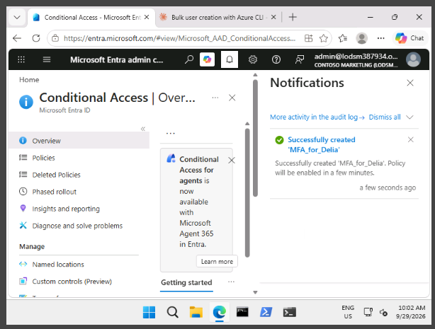
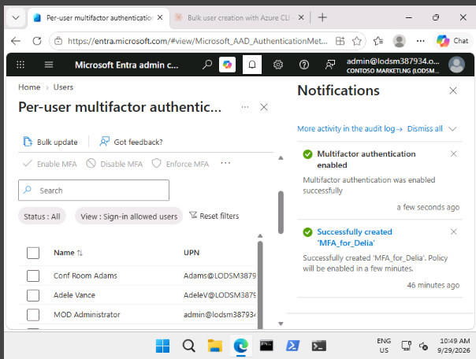

## Lab 8 – Enable multifactor authentication

**Scenario:** to make sign-ins more secure, the organization wants multifactor authentication (MFA) turned on in Microsoft Entra ID. This lab needs a tenant with a **Microsoft Entra ID Premium** license.

**Contents**
- [Exercise 1 – Review and enable MFA](#exercise-1--review-and-enable-mfa)
- [Exercise 2 – Require MFA for a user at sign-in](#exercise-2--require-mfa-for-a-user-at-sign-in)

---

### Exercise 1 – Review and enable MFA

**Task 1 – Review the MFA options**

1. Signed in to the Microsoft Entra admin center (`entra.microsoft.com`) as a Global Administrator.
2. Searched for `multifactor` and opened **Multifactor authentication**. It can also be found under **Entra ID** in the left menu.
3. On the **Getting started** page, under **Configure**, selected **Additional cloud-based multifactor authentication settings**.
4. In the new browser page, looked at the MFA options for users and the service settings. This is where the allowed verification methods are chosen, and where app passwords can be switched on or off. App passwords give a user a separate password for an app that can't use MFA.

**Task 2 – Create a Conditional Access policy that requires MFA for Delia Dennis**

1. Back in the Entra admin center, went to **Entra ID > Conditional Access** and selected **+ New policy**.
2. Named the policy `MFA_for_Delia`.
3. Under **Users**, chose **Select users and groups**, ticked **Users and groups**, and picked **Delia Dennis**.
4. Under **Target resources**, made sure **Resources (formerly cloud apps)** was selected, chose **Select resources**, and picked **Office 365**.
5. Under **Network**, set **Configure** to **Yes** and included **Any network or location**.
6. Under **Grant**, ticked **Require multifactor authentication**, with **Require all the selected controls** chosen, then selected **Select**.
7. Switched **Enable policy** to **On** and selected **Create**.

**Task 3 – Test Delia's sign-in**

1. Opened a new InPrivate window and went to `office.com`.
2. Selected sign-in and entered Delia's email address and password.
3. Expected result: Delia is asked to set up the Authenticator app and register for MFA, because the policy now requires MFA to open the Microsoft 365 home page. If the sign-in fails once, choose **Try again**.

**Result:** a Conditional Access policy can require MFA for one user and one app without changing anyone else's sign-in.

---

### Exercise 2 – Require MFA for a user at sign-in

**Task 1 – Turn on per-user MFA**

1. In the Entra admin center, went to **Entra ID > Users > All users** and selected **Per-user MFA** at the top. It may be under the **...** menu.
2. A new browser tab opened with the multifactor authentication user settings.
3. Ticked **Adele Vance**, chose **Enable MFA** under **Quick steps**, read the pop-up, and selected **Enable**, then **Close**.
4. Adele's MFA status now shows **Enabled**.
5. Selected **Service settings** to see the same settings page as in Exercise 1, then closed the tab.

**Task 2 – Try signing in as Adele (optional)**

The lab suggests signing in as Adele to see the MFA prompt for a second user.

**Result:** MFA can be set per user in the older per-user page, or by policy with Conditional Access. Conditional Access is the more flexible option because it can target apps, networks and groups.

---

### Key takeaways

- A Conditional Access policy decides who needs MFA, for which apps, and from where.
- Per-user MFA is the simpler, older way to turn MFA on for individual accounts.
- The first time a user signs in after MFA is required, they are asked to register a verification method such as the Authenticator app.
- MFA protects accounts even when a password has been stolen.
