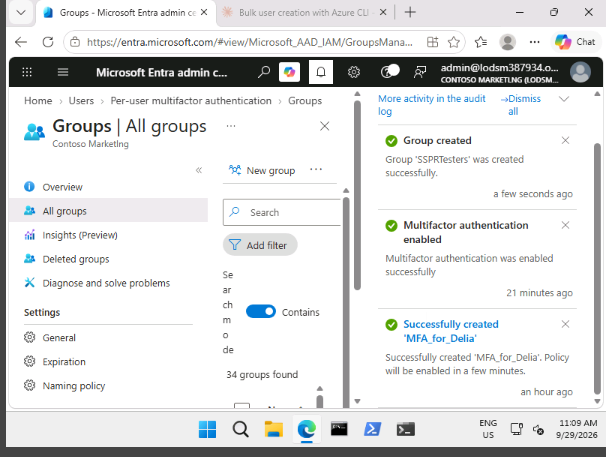
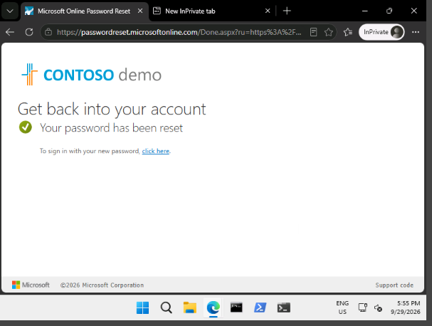

## Lab 9 – Configure and deploy self-service password reset

**Scenario:** the company wants employees to reset their own passwords. Self-service password reset (SSPR) is rolled out to a small test group first, to check the setup works before everyone gets it.

**Contents**
- [Exercise 1 – Create a group with SSPR turned on and add users](#exercise-1--create-a-group-with-sspr-turned-on-and-add-users)

---

### Exercise 1 – Create a group with SSPR turned on and add users

**Task 1 – Create a group for the test rollout**

1. Signed in to the Microsoft Entra admin center (`entra.microsoft.com`) as a Global Administrator.
2. Went to **Entra ID > Groups > All groups** and selected **New group**.
3. Filled in the form:
   - Group type: **Security**
   - Group name: **SSPRTesters**
   - Group description: **Testers of SSPR rollout**
   - Membership type: **Assigned**
   - Members: **Alex Wilber**, **Allan Deyoung** and **Bianca Pisani**
4. Selected **Create**.

**Task 2 – Turn on SSPR for the test group**

1. Went to **Entra ID > Password reset** and opened **Properties**.
2. Under **Self service password reset enabled**, chose **Selected**.
3. Replaced the existing group with **SSPRTesters** and selected **Save**.
4. Under **Manage**, looked through the default settings for **Authentication methods**, **Registration**, **Notifications** and **Customization**. **Phone** needs to be one of the allowed methods for the rest of the lab.

**Task 3 – Register Allan for SSPR**

1. Opened an InPrivate window and went to `aka.ms/ssprsetup`, so a fresh sign-in is requested.
2. Signed in as Allan Deyoung and changed the password if asked. Chose **Yes** to stay signed in.
3. At **More information required**, selected **Next**.
4. On **Keep your account secure**, selected **Next** to use the Authenticator app, then scanned the QR code in the app and finished with **Done**.
5. Closed the browser. This one step registers the user for both SSPR and MFA.

**Task 4 – Test the password reset**

1. Opened an InPrivate window and went to the Azure portal (`portal.azure.com`).
2. Entered Allan's email address and selected **Next**, then **Forgot my password**.
3. Completed the **Get back into your account** page, then approved with the verification code from the Authenticator app.
4. Chose and confirmed a new password, then selected **Finish**.
5. The page confirmed that the password had been reset, and Allan could then sign in with the new password.

**Task 5 – Try a user who isn't in the group**

1. Opened a new InPrivate window and went to the Azure portal.
2. Entered the email address for Grady Archie (`GradyA`) and selected **Forgot my password**.
3. Expected result: because Grady isn't in **SSPRTesters**, password reset isn't offered and he is told to contact an administrator.

**Result:** SSPR can be switched on for a chosen group first, so problems are found before the whole company is affected.

---

### Key takeaways

- SSPR can be turned on for everyone or for a selected group, which suits a staged rollout.
- Users must register at least one verification method, such as the Authenticator app or a phone, before they can reset a password.
- Registering at `aka.ms/ssprsetup` sets up both SSPR and MFA in one go.
- A user outside the selected group can't use SSPR, so the reset has to go through the help desk.
